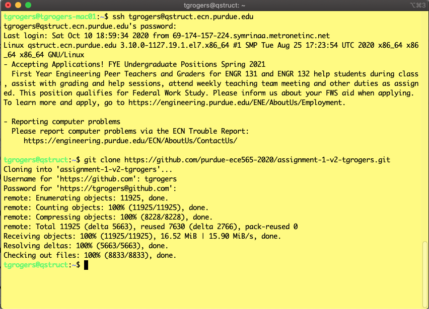
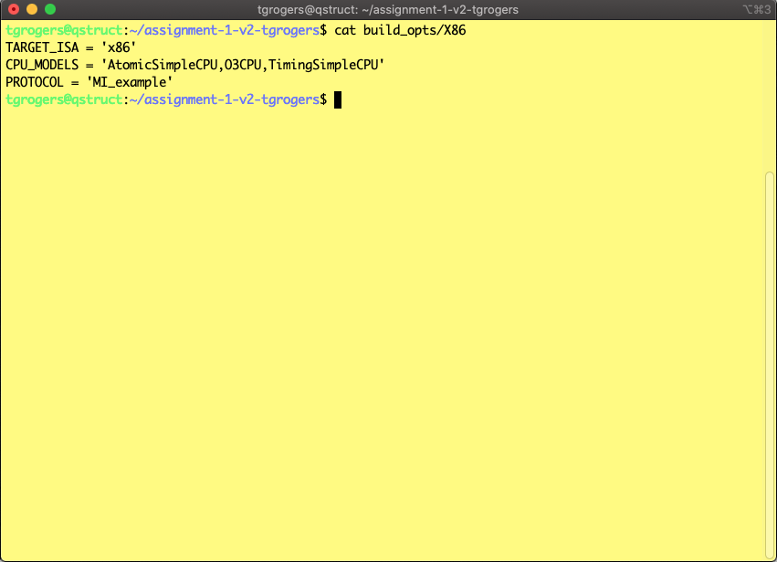

## ECE 565 Programming Assignment 1 Fall 2020
### Professor Tim Rogers

1. **Introduction**
    
    This assignment will serve as an introduction to the gem5 simulator. It will walk you through the necessary steps to set up the simulator on your account, and provide you with some introductory tasks that will help you familiarize yourself with the gem5 structure and source tree. While the tasks aren’t difficult in and of themselves, do not underestimate the time it will take to get familiar with the gem5 source tree before you’ll be able to complete the tasks.
 The gem5 simulator is written primarily in C++. However, configurations are done in Python, so you’ll need to be familiar with Python as well. It’s easy to read, but be aware that spacing in Python matters if you find yourself editing a Python file for the first time – it’s worth finding a quick tutorial on Python to learn the basics. A utility called SWIG is used to combine the configurations in Python and the actual simulator written in C++.
    
1. **Setup**
    
    The assignment has been made available through github classroom. To sign up - please link your github account with your Purdue email by following the directions here:
    
    https://classroom.github.com/a/WB9TgrPS
    
    The programming assignment will be completed on a cluster of "qstruct" servers. There are 19 of these machines. You can access them by ssh’ing into qstruct.ecn.purdue.edu from any terminal. You will use your Purdue Career Account username and password. Below is the sample command for logging in:
    ```console
    ssh <your-career-user-id>@qstruct.ecn.purdue.edu
    ```
    
    Once logged into qstruct, you will need to install a missing python package and clone your version of the assignment from github classroom. To make a copy of your code locally use:
    
    ```console
    pip3 install --user six
    module load git # you should add this line to your ~/.bashrc file so that each time you login - otherwise you will end up using an ancient git version
    git clone https://github.com/purdue-ece565-2020/assignment-1-v4-<your-github-user-name>.git
    ```
    
    Git is the world's most popular revision control system, so if you are not familiar with it, now is a great time :).
    Given it's popularity, it is very well documented simply googling will give you a number of high-quality tutorials to get you familiar with it. This assignemnet doc will provide you with the basic commands.
    You now have your own fresh copy of gem5! Going into your gem5 directory, you’ll see a variety of folders, including the src directory, where most of your changes will be made. You may find yourself working in the configs directory from time to time as well. It is worth spending some time exploring these directories to get a feel for where different things are.
    
    
    
1. **Building gem5**
    
    gem5 is a highly configurable architectural simulator that supports a number of ISAs (x86, ARM, MIPS, SPARC, POWER, RISCV), CPU Models (InOrder, O3, AtomicSimple, TimingSimple), and two Memory Models (Classic, Ruby). To understand how to build gem5, you must understand what you are building first. Example gem5 build files are located in gem5/build_opts. For example, the ’X86’ file is as follows:
    
    ```console
    TARGET_ISA = ’x86’
    CPU_MODELS = ’AtomicSimpleCPU,TimingSimpleCPU,O3CPU’
    PROTOCOL = ’MI_example’
    ```
    
    
    
    In this assignment, we will need the *MinorCPU* model, which we can add to the *X86* build options by adding it to the *CPU_MODELS* list, before you compile.
    
    We will be using the latest version of gem5, which has fairly up-to-date documentation outside of this assignment.
    For additional pointers on gem5, please see the book on learning gem5:
    
    https://www.gem5.org/documentation/learning_gem5/introduction/
    
    This file indicates that the target ISA is X86, and all of the CPU Models should be compiled in. The last line PROTOCOL is a specific type of coherence protocol for the Ruby Memory Model, which we will ignore for now.
For this assignment, we will use the x86 and ARM build configurations. Now, the command to build this configuration is:
    
    ```console
    scons-3 -j 4 ./build/X86/gem5.opt
    ```
    
    You may be missing the gem5 style hook. If so, just hit enter and let the script install the style hook for you. This build will take quite a while the first time around, so using multiple processes is valuable. Even with 4 processes, it can take over 10 minutes to build. When you build the simulator with scons, all of your source code is copied into the gem5/build directory for that particular build. This means two things. First, you can always simply remove the build directory (or a specific build’s directory inside gem5/build) to start from scratch (think of it like a "make clean"). Second, never make any manual changes within the build directory. You should make your changes elsewhere (i.e. gem5/src), and re-build the simulator. Re-building gem5 after the first build typically only takes a minute or two, depending on your changes.

1. **Running gem5: Hello World**
    
    The gem5.opt file you built with scons is your binary – this is what you will use to run the simulator. It takes in options and a simulation script (this is where Python comes in). To get started, let’s run a Hello World program on the simulator. Looking in your gem5/configs directory, you’ll see directories including example and spec2k6. You’ll be using spec2k6 configurations to run benchmarks later, but for now take a look in the example directory. The se.py script will be what we need to run Hello World. Take a look at it. You won’t understand all of it just now, but you’ll see how it’s setting up different gem5 configurations.
    
    Now that we have a script to use with gem5, we need an actual Hello World binary to run on the simulator. gem5 comes with Hello World binaries already compiled for each ISA it supports. You can find them in gem5/tests/test-progs/hello/bin. Since we’ve built an x86 model, we’ll want the gem5/tests/test-progs/hello/bin/x86/linux/hello binary. 
    
    To actually run Hello World, go back to your gem5/ directory. The gem5 binary, the configuration script, and the hello binary are all used with the following command:
    
    ```console
    ./build/X86/gem5.opt configs/example/se.py -c tests/test-progs/hello/bin/x86/linux/hello
    ```
   
    Notice that now there is a gem5/m5out directory. Inside, you’ll see a couple of configuration and stats files – they’re specific to your Hello World run. These will be very useful for tracking data in the future.
    
1. **Running gem5: Benchmarks**
    
    For the programming assignment, you’ll need to run benchmarks from the SPEC2006 benchmark suite. These are available at /home/min/a/ece565/benchspec-2020/, and a Python configuration script to run the benchmarks is in your copy of gem5.
    The benchmarks you’ll be running in this assignment are sjeng, libquantum, and bzip2.
    
    Using the gem5/configs/spec2k6/run.py script, you can run the following command:
    
    ```console
    scons-3 -j 4 ./build/ARM/gem5.opt
    ./build/ARM/gem5.opt -d my_outputs configs/spec2k6/run.py -b bzip2 --maxinsts=250000 --cpu-type=MinorCPU --l1d_size=64kB --l1i_size=16kB --caches --l2cache
    ```
    
    As before with Hello World, we simply use the gem5.opt binary we built to run the simulator. However, here we added a -d flag to the gem5.opt run. This allows us to specify an output directory, rather than use the default m5out directory we saw during our Hello World run. You can see the new "my_outputs" directory created for the output of this run. Note that the -d flag came before the Python script file. This is because the -d flag is an option for the gem5.opt binary, not an option for the script.
    
    There are a number of other options we passed to the script to run the simulator with a particular CPU and cache configuration. To see the entire setup of any run, refer to the *config.ini* in the output directory (for example *my_outputs/config.ini*). This will contain the actual system simulated. You can play with these parameters as you like (and add your own options).
    
    Now looking at the script used to run the SPEC2006 benchmarks, we see it’s located in the configs/spec2k6 directory we saw earlier. Here, we use the -b flag to specify which benchmark we want to run – in this case, bzip2. The --maxinsts=X flag is used to specify how many instructions to run the benchmarks for. These benchmarks are massive and take hours upon hours to complete in full, so it will often be useful to run them only for a specific number of instructions. Since these options all apply to the script, they come after the script in the command, not before it.
    
    Try running the other benchmarks, sjeng and libquantum, and have them all output to separate directories. More options for the gem5/configs/spec2k6/run.py script can be seen by using the -h flag, or by going into the file and looking around.

1. **Assignment**
    
    gem5 is an immensely complex piece of software with over 100k lines of code. However, it is not necessary to understand all of gem5 prior to being able to effectively use it. For this assignment you should focus on the *MinorCPU* Model located in /src/cpu/minor. The *MinorCPU* currently models a simple pipelined.  (Hint: Use the -h flag with your Python script to find out how to specify the CPU model you use.)
    One caveat of this CPU model is that each pipeline stage/component inherits from an abstracted resource object. As with every resource, there is the contingency of encountering a structural hazard. The occurrence of a structural hazard is dependent on the width of the corresponding stage. Thus in order to model one outstanding instruction per stage, you have to adjust the width of each stage to be 1 (*hint: look inside MinorCPU.py*).
    For this programming assignment, you will be required to implement the following changes in gem5:

    * Evaluate a simple pipeline.
    * Degrade branch prediction
    * Split the Execution stage into two separate pipeline stages
    
    Each of these are detailed further below. For part (i), just evaluate the example code, running to completion. For parts (ii) and (iii), you will need to run the sjeng, bzip2, and libquantum benchmarks for 100 million instructions.  These results will then be compared to the baseline gem5 performance for the MinorCPU model. Make sure to take advantage of different output directories to avoid overwriting output data from different runs.
    
    A nice overview of MinorCPU can be found here: https://www.gem5.org/documentation/general_docs/cpu_models/minor_cpu
    
    1. **Evaluate a Simple Pipeline**
    
        In this task - you will write a C program, compile it then run it using different CPU models. 
    
        1. **Run a custom program**
            
            The DAXPY loop (double precision aX + Y) is an oft used operation in programs that work with matrices and vectors. The following code implements DAXPY in C++11.
            Place the code inside a new directory *part1/daxpy.cc*.
    
            ```cpp
            #include <random>
            #include <iostream>
            
            int main()
            {
                const int N = 1000;
                double X[N];
                double Y[N];
                double alpha = 0.5;
                std::random_device rd; std::mt19937 gen(rd());
                std::uniform_real_distribution<> dis(1, 2);
                for (int i = 0; i < N; ++i)
                {
                X[i] = dis(gen);
                Y[i] = dis(gen);
                }
            
                // Start of daxpy loop
                for (int i = 0; i < N; ++i)
                {
                    Y[i] = alpha * X[i] + Y[i];
                }
                // End of daxpy loop
   
                double sum = 0;
                for (int i = 0; i < N; ++i)
                {
                    sum += Y[i];
                }
                std::cout << sum;
                return 0;·
            }
            ```
            
        
            Your first task is to compile this code statically and simulate it with gem5 using the timing simple cpu.
            To compile the code on qstruct, use the following compiler arguments (for c++11 and optimizations):
                    
            ```console
            g++ -O2 -std=gnu++11 daxpy.cc
            ```
            Compile the program with -O2 flag to avoid running into unimplemented x87 instructions while simulating with gem5. Report the breakup of instructions for different op classes. For this, grep for op_class in the file stats.txt. Run the compiled file using
            
            ```console
            ./build/X86/gem5.opt configs/example/se.py -c <output-from-daxpy-build>
            ```
    
        1. **Examine the assembly**
            
            Generate the assembly code for the daxpy program above by using the -S and -O2 options when compiling with GCC. As you can see from the assembly code, instructions that are not central to the actual task of the program (computing aX + Y) will also be simulated. This includes the instructions for generating the vectors X and Y, summing elements in Y and printing the sum. When I compiled the code with -S, I got about 350 lines of assembly code, with only about 10-15 lines for the actual daxpy loop.

            Usually while carrying out experiments for evaluating a design, one would like to look only at statistics for the portion of the code that is most important. To do so, typically programs are annotated so that the simulator, on reaching an annotated portion of the code, carries out functions like create a checkpoint, output and reset statistical variables.

            You will edit the C++ code from the first part to output and reset stats just before the start of the DAXPY loop and just after it. For this, include the file ./include/gem5/m5ops.h in the program. Use the function m5_dump_reset_stats() from this file in your program. This function outputs the statistical variables and then resets them. You can provide 0 as the value for the delay and the period arguments.

            To provide the definition of the m5_dump_reset_stats(), go to the directory util/m5/src/x86/ and edit the SConsopts in the following way:

            ```console
            diff --git a/util/m5/src/x86/SConsopts b/util/m5/src/x86/SConsopts
            index 8763f29..7be70a3 100644
            --- a/util/m5/src/x86/SConsopts
            +++ b/util/m5/src/x86/SConsopts
            @@ -27,7 +27,6 @@ Import('*')
               
            env['VARIANT'] = 'x86'
            get_variant_opt('CROSS_COMPILE', '')
            -env.Append(CFLAGS='-DM5OP_ADDR=0xFFFF0000')
                
            env['CALL_TYPE']['inst'].impl('m5op.S')
            env['CALL_TYPE']['addr'].impl('m5op_addr.S', default=True)
            ```
            
            Execute the following command in the directory util/m5:
                
            ```console
            scons-3 src/x86 
            ```
            
            This will create an object file named util/m5/build/x86/x86/m5op.o. Link this file with the program for DAXPY. Now again simulate the program with the timing simple CPU. This time you should see three sets of statistics in the file stats.txt. Report the breakup of instructions among different op classes for the three parts of the program. In the assisngment report, provide the fragment of the generated assembly code that starts with the call to m5_dumpreset_stats() and ends m5_dumpreset_stats(), and has the main daxpy loop in between.
            
        1. **Examine CPU types**
        
            There are several different types of CPUs that gem5 supports: atomic, timing, out-of-order, inorder and kvm. Let's talk about the timing and the inorder cpus. The timing CPU (also known as SimpleTimingCPU) executes each arithmetic instruction in a single cycle, but requires multiple cycles for memory accesses. Also, it is not pipelined. So only a single instruction is being worked upon at any time. The inorder cpu (also known as Minor) executes instructions in a pipelined fashion. It has the following pipe stages: fetch1, fetch2, decode and execute.

            Take a look at the file MinorCPU.py. In the definition of MinorFU, the class for functional units, we define two quantities opLat and issueLat. From the comments provided in the file, understand how these two parameters are to be used. Also note the different functional units that are instantiated as defined in class MinorDefaultFUPool.

            Assume that the issueLat and the opLat of the FloatSimdFU can vary from 1 to 6 cycles and that they always sum to 7 cycles. For each decrease in the opLat, we need to pay with a unit increase in issueLat. Which design of the FloatSimd functional unit would you prefer? Provide statistical evidence obtained through simulations of the annotated portion of the code for daxpy.
            
            If you wish - you can use the following new configuration file that provides an example of how to extend the MinorCPU with options for op/issue latency.
            
            ```python
            # -*- coding: utf-8 -*-
            # Copyright (c) 2015 Mark D. Hill and David A. Wood
            # All rights reserved.
            #
            # Redistribution and use in source and binary forms, with or without
            # modification, are permitted provided that the following conditions are
            # met: redistributions of source code must retain the above copyright
            # notice, this list of conditions and the following disclaimer;
            # redistributions in binary form must reproduce the above copyright
            # notice, this list of conditions and the following disclaimer in the
            # documentation and/or other materials provided with the distribution;
            # neither the name of the copyright holders nor the names of its
            # contributors may be used to endorse or promote products derived from
            # this software without specific prior written permission.
            #
            # THIS SOFTWARE IS PROVIDED BY THE COPYRIGHT HOLDERS AND CONTRIBUTORS
            # "AS IS" AND ANY EXPRESS OR IMPLIED WARRANTIES, INCLUDING, BUT NOT
            # LIMITED TO, THE IMPLIED WARRANTIES OF MERCHANTABILITY AND FITNESS FOR
            # A PARTICULAR PURPOSE ARE DISCLAIMED. IN NO EVENT SHALL THE COPYRIGHT
            # OWNER OR CONTRIBUTORS BE LIABLE FOR ANY DIRECT, INDIRECT, INCIDENTAL,
            # SPECIAL, EXEMPLARY, OR CONSEQUENTIAL DAMAGES (INCLUDING, BUT NOT
            # LIMITED TO, PROCUREMENT OF SUBSTITUTE GOODS OR SERVICES; LOSS OF USE,
            # DATA, OR PROFITS; OR BUSINESS INTERRUPTION) HOWEVER CAUSED AND ON ANY
            # THEORY OF LIABILITY, WHETHER IN CONTRACT, STRICT LIABILITY, OR TORT
            # (INCLUDING NEGLIGENCE OR OTHERWISE) ARISING IN ANY WAY OUT OF THE USE
            # OF THIS SOFTWARE, EVEN IF ADVISED OF THE POSSIBILITY OF SUCH DAMAGE.
            #
            # Authors: Jason Power
            
            """ CPU based on MinorCPU with options for a simple gem5 configuration script

            This file contains a CPU model based on MinorCPU that allows for a few options
            to be tweaked. 
            Specifically, issue latency, op latency, and the functional unit pool.

            See src/cpu/MinorCPU.py for MinorCPU details.

            """

            from m5.objects import MinorCPU, MinorFUPool
            from m5.objects import MinorDefaultIntFU, MinorDefaultIntMulFU
            from m5.objects import MinorDefaultIntDivFU, MinorDefaultFloatSimdFU
            from m5.objects import MinorDefaultMemFU, MinorDefaultFloatSimdFU
            from m5.objects import MinorDefaultMiscFU
    
            class MyFloatSIMDFU(MinorDefaultFloatSimdFU):
    
            # From MinorDefaultFloatSimdFU
            # opLat = 6
    
            # From MinorFU
            # issueLat = 1

                def __init__(self, options=None):
                    super(MinorDefaultFloatSimdFU, self).__init__()

                    if options and options.fpu_operation_latency:
                        self.opLat = options.fpu_operation_latency

                    if  options and options.fpu_issue_latency:
                        self.issueLat = options.fpu_issue_latency


            class MyFUPool(MinorFUPool):
                def __init__(self, options=None):
                    super(MinorFUPool, self).__init__()
                    # Copied from src/mem/MinorCPU.py
                    self.funcUnits = [MinorDefaultIntFU(), MinorDefaultIntFU(),
                                  MinorDefaultIntMulFU(), MinorDefaultIntDivFU(),
                                  MinorDefaultMemFU(), MinorDefaultMiscFU(),
                                  # My FPU
                                  MyFloatSIMDFU(options)]


            class MyMinorCPU(MinorCPU):
                def __init__(self, options=None):
                    super(MinorCPU, self).__init__()
                    self.executeFuncUnits = MyFUPool(options)
    
            ```
            
    1. **Degrade Branch Prediction**
        
        For this part and the following part (split execution stage) you should use the ARM build of gem5. Make sure you are building the ARM version using the command line:
        
        ```console
        scons-3 -j 4 ./build/ARM/gem5.opt
        ```
        
        Also - make sure you have applied the arm patch (if you already did this, then skip this step).
        
        [Patch to run ARM Spec](arm.patch)
    
        Do this by downloading the patch, then running the following from the assignment directory:
    
        ```console
        git apply arm.patch
        ```
        
        The MinorCPU already implements a few branch predictor modules, including a tournament predictor and a simpler Branch Target Buffer (BTB). The pipeline timing enables you to figure out at the EX stage whether or not the branch prediction was correct. What you need to do is implement an option that will allow you to not only enable/disable the branch predictor, but degrade its accuracy to different levels as well.
        
        Note that the pipeline already handles the squashing of instructions fetched from the wrong path. On a misprediction, the pipeline will initiate calls to update the corresponding branch predictor’s entry with the correct target address.
        
        It would be functionally correct to squash the pending instructions if the predicted target is correct, but it would not be functionally correct to consider the branch correctly predicted when the predicted target does not match the actual branch target, and still consider it to be correct. For this part of the assignment, you need to implement a feature that degrades the branch predictor’s accuracy by treating some correctly predicted branches as incorrect. You will need to generate a random number between 0 and 1, and for a specified accuracy of X%, if the generated number is greater than X%, consider it a misprediction. Note that this "accuracy" is not the branch predictor’s accuracy, but the percentage of it’s original accuracy. That is, 100% would be equal to the default branch predictor’s accuracy, 50% would be half of the original predictor’s accuracy, and 0% would be an always incorrect predictor – it always predicts the wrong thing.
        
        For this, you will need to run the benchmark simulations for those three "accuracies:"
        
        * 100%
        * 50%
        * 0%
        
    1. **Split Execution Stage**
    
        For this part, we want to be able to split up the Execution Unit into two stages. Modern pipelines employ deeper pipelines in order to increase the clock frequency. Instead of having a more complex stage that requires additional cycles, the corresponding stage is split into smaller stages, where each requires fewer cycles. However, as you know there is a trade-off for every design decision. What you need to do is split up the EX stage into EX1 + EX2 accordingly. The simplest way to do this is to create a "dummy" stage in front of the current execute that does nothing but pass the input tot EX stage along.

1. **Submission instructions**
    
    You will submit your code through the github classroom interface. Some basic command you will need for git are:
    
    ```console
    git status # Tells you what files you have modified
    git add <file name> # Once you have modified a file, adding it will "stage" it for commiting.
    git commit # commits all the files you currently have staged
    git push # sends all the commits you have made to the remote reposity, where they are backed up and the instructor can see them.
    ```
    
    Note that gem5 has some committing requirements. You have to structure your commit message like:
    
    ```console
    git commit -m "<component-touched>: short description"
    # i.e.
    git commit -m "python: made the scripts work with python3"
    ```
    
    This restriction is mostly for development purposes, if you want to tag everything with *cpu:* or *python*, thats fine.
    
    As a general rule (for your own sake) I recommend committing often, so that you can undo things you messed up and you have a nice record for yourself of all the things you have done. When grading the assignment, I will only look at the final version of the code, regardless of the commit history.
    
    Submit a report (maximum three pages) with graphs and/or tables to present results via brightspace. Each graph should summarize the results of one of the experiments. (Suggested format: Plot bar-graphs with benchmarks on the X-axis and IPC on the Y-axis. For each benchmark, show two or more bars; one is the baseline and the rest correspond to your changes.) The report is NOT meant to be an exercise in writing. I do not expect any text beyond a 2-3 sentence summary of the key observations for each graph. However, this is a minimum and not a maximum. If you have text you want me to see (e.g., assumptions, simplifications, data-gathering difficulties etc.), feel free to write additional text in the report. Also if the branch of code you want me to look at is anything other than *master*, please indicate this in the report.
